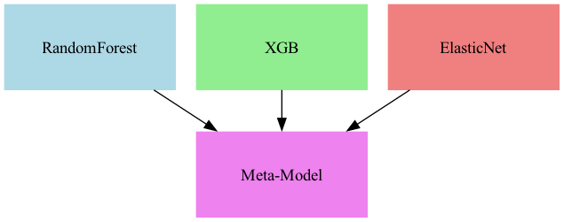

## Skies Unveiled: Patterns, Predictions, and Anomalies in Weather Data

How accurately can a SARIMA model forecast temperature values while accounting for anomalies in the data, and how robust is the model's performance in identifying and predicting anomalous patterns in the time series?

### Introduction

The dataset, [Global Weather Repository](https://www.kaggle.com/datasets/nelgiriyewithana/global-weather-repository/code), provides comprehensive meteorological data collected from various locations 
worldwide. It offers insights into various weather parameters, including temperature, precipitation, and humidity, 
enabling detailed global climate patterns and trend analysis. This dataset is valuable for understanding
weather-related phenomena and their implications on environmental and societal systems.

<p>
Before any cleaning, the dataset contains 46967 rows.  
The following columns are relevant to the analysis:
</p>

| Column Name                      | Description                                                              |
|----------------------------------|--------------------------------------------------------------------------|
| country                          | The name of the country where the weather data was recorded.             |
| location_name                    | The specific location name for the weather data.                         |
| latitude                         | The latitude of the location in decimal degrees.                         |
| longitude                        | The longitude of the location in decimal degrees.                        |
| timezone                         | The timezone of the location.                                            |
| last_updated                     | The last update time in a human-readable format.                         |
| temperature_celsius              | The temperature at the location in degrees Celsius.                     |
| condition_text                   | A description of the current weather condition.                         |
| wind_kph                         | The wind speed in kilometers per hour.                                   |
| wind_degree                      | The direction of the wind in degrees.                                    |
| wind_direction                   | The cardinal direction of the wind.                                      |
| pressure_mb                      | The atmospheric pressure at the location in millibars.                  |
| precip_mm                        | The amount of precipitation in millimeters.                             |
| humidity                         | The percentage of atmospheric moisture at the location.                 |
| cloud                            | The percentage of cloud cover at the location.                          |
| uv_index                         | The UV index indicates the strength of ultraviolet radiation.           |
| gust_kph                         | The speed of wind gusts in kilometers per hour.                         |
| air_quality_Carbon_Monoxide      | The concentration of carbon monoxide in the air.                        |
| air_quality_Ozone                | The concentration of ozone in the air.                                  |
| air_quality_Nitrogen_dioxide     | The concentration of nitrogen dioxide in the air.                       |
| air_quality_Sulphur_dioxide      | The concentration of sulfur dioxide in the air.                        |
| air_quality_PM2.5                | The concentration of particulate matter smaller than 2.5 micrometers.   |
| air_quality_PM10                 | The concentration of particulate matter smaller than 10 micrometers.    |
| air_quality_us-epa-index         | The air quality index as per the US EPA standards.                      |
| air_quality_gb-defra-index       | The air quality index as per the UK DEFRA standards.                    |
| moon_illumination                | The percentage of the moon that is illuminated.                         |


### Data Cleaning 
- Removed columns that were either irrelevant to the analysis or provided redundant information, such as duplicate measurements in different units or unnecessary time-related columns.
- Transformed the `last_updated` column into a DateTime format for consistency and easier time-based analysis.

Cleaned Dataset:


| country     | location_name    |   latitude |   longitude | timezone       | last_updated        |   temperature_celsius | condition_text   |   wind_kph |   wind_degree | wind_direction   |   pressure_mb |   precip_mm |   humidity |   cloud |   feels_like_celsius |   visibility_km |   uv_index |   gust_kph |   air_quality_Carbon_Monoxide |   air_quality_Ozone |   air_quality_Nitrogen_dioxide |   air_quality_Sulphur_dioxide |   air_quality_PM2.5 |   air_quality_PM10 |   air_quality_us-epa-index |   air_quality_gb-defra-index |   moon_illumination |   Temperature_Z |   Precipitation_Z | Anomaly_Temperature_Z   | Anomaly_Precipitation_Z   | Anomaly_Temperature_IQR   | Anomaly_Precipitation_IQR   |
|:------------|:-----------------|-----------:|------------:|:---------------|:--------------------|----------------------:|:-----------------|-----------:|--------------:|:-----------------|--------------:|------------:|-----------:|--------:|---------------------:|----------------:|-----------:|-----------:|------------------------------:|--------------------:|-------------------------------:|------------------------------:|--------------------:|-------------------:|---------------------------:|-----------------------------:|--------------------:|----------------:|------------------:|:------------------------|:--------------------------|:--------------------------|:----------------------------|
| Afghanistan | Kabul            |      34.52 |       69.18 | Asia/Kabul     | 2024-05-16 13:15:00 |                  26.6 | Partly Cloudy    |       13.3 |           338 | NNW              |          1012 |         0   |         24 |      30 |                 25.3 |              10 |          7 |       15.3 |                         277   |               103   |                            1.1 |                           0.2 |                 8.4 |               26.6 |                          1 |                            1 |                  55 |       0.370189  |        -0.231145  | False                   | False                     | False                     | False                       |
| Albania     | Tirana           |      41.33 |       19.82 | Europe/Tirane  | 2024-05-16 10:45:00 |                  19   | Partly cloudy    |       11.2 |           320 | NW               |          1012 |         0.1 |         94 |      75 |                 19   |              10 |          5 |       18.4 |                         193.6 |                97.3 |                            0.9 |                           0.1 |                 1.1 |                2   |                          1 |                            1 |                  55 |      -0.474459  |        -0.0743989 | False                   | False                     | False                     | True                        |
| Algeria     | Algiers          |      36.76 |        3.05 | Africa/Algiers | 2024-05-16 09:45:00 |                  23   | Sunny            |       15.1 |           280 | W                |          1011 |         0   |         29 |       0 |                 24.6 |              10 |          5 |       22.3 |                         540.7 |                12.2 |                           65.1 |                          13.4 |                10.4 |               18.4 |                          1 |                            1 |                  55 |      -0.0299074 |        -0.231145  | False                   | False                     | False                     | False                       |
| Andorra     | Andorra La Vella |      42.5  |        1.52 | Europe/Andorra | 2024-05-16 10:45:00 |                   6.3 | Light drizzle    |       11.9 |           215 | SW               |          1007 |         0.3 |         61 |     100 |                  3.8 |               2 |          2 |       13.7 |                         170.2 |                64.4 |                            1.6 |                           0.2 |                 0.7 |                0.9 |                          1 |                            1 |                  55 |      -1.88591   |         0.239093  | False                   | False                     | False                     | True                        |
| Angola      | Luanda           |      -8.84 |       13.23 | Africa/Luanda  | 2024-05-16 09:45:00 |                  26   | Partly cloudy    |       13   |           150 | SSE              |          1011 |         0   |         89 |      50 |                 28.7 |              10 |          8 |       20.2 |                        2964   |                19   |                           72.7 |                          31.5 |               183.4 |              262.3 |                          5 |                           10 |                  55 |       0.303506  |        -0.231145  | False                   | False                     | False                     | False                       |

### Advanced Exploratory Data Analysis

#### Statistical Anomaly Detection

Moving forward, I am choosing to focus on **precipitation** and **temperature** as key variables for statistical anomaly detection. Temperature and precipitation offer a meaningful basis for comparison across different locations and periods, making them ideal for detecting and understanding statistical anomalies in weather data. This focus will enable a targeted and practical approach to uncovering significant outliers and trends.

#### Z-Score and IQR 

We will first use the Z-Score and IQR methods to flag statistical anomalies.

<div style="margin-bottom: 5px;">
  <iframe src="assets/temp_comp.html" width="800" height="400px" frameborder="0" scrolling="yes" style="transform: translateX(-50px);margin-bottom: 5px;"></iframe>
</div>

<div style="margin-bottom: 5px;">
  <iframe src="assets/prec_comp.html" width="800" height="400px" frameborder="0" scrolling="yes" style="transform: translateX(-50px);margin-bottom: 5px;"></iframe>
</div>

**Z-Score Method**
- Values that exceed a threshold of `abs(z) > 3` are flagged as outliers.
- Total number of outliers predicted for temperature: 258 out of 46967 data points.
- Total number of outliers predicted for precipitation: 566 out of 46967 data points.
  
**IQR Method**
- Values beyond `1.5 * IQR` from the first or third quartile are flagged as outliers.
- Total number of outliers predicted for temperature: 1527 out of 46967 data points.
- Total number of outliers predicted for precipitation: 9092 out of 46967 data points.

The vast difference in the number of outliers predicted can be due to the fact that the Z-Score method assumes that the data is normally distributed while the IQR method makes no such assumption. It is thus important to assess the skewness of the data for more accurate predictions.


<div style="margin-bottom: 5px;">
  <iframe src="assets/temp_box.html" width="800" height="600px" frameborder="0" scrolling="yes" style="transform: translateX(-50px);margin-bottom: 5px;"></iframe>
</div>

**Temperature Skewness: -0.86**


<div style="margin-bottom: 5px;">
  <iframe src="assets/prec_box.html" width="800" height="600px" frameborder="0" scrolling="yes" style="transform: translateX(-50px);margin-bottom: 5px;"></iframe>
</div>

**Precipitation Skewness: 19.56**


- The near-normal distribution of temperature with a skewness of -0.86 suggests the distribution is approximately symmetric, and thus the Z-Score method is likely more reliable for temperature anomalies.
- The slight negative skew indicates that some lower temperature values pull the mean below the median.
- Precipitation skewness of 19.56 indicates a highly right-skewed distribution, meaning there are many days with low precipitation and a few extreme outliers with high precipitation. The IQR method, being non-parametric, is better suited for such data.
- Most precipitation values are near zero, with a few extreme values causing the skew.

In order to further assess, our anomaly detection, we will now use a data-driven anomaly detection method to evaluate our results.

#### Isolation-Forest   
- Total number of outliers predicted for temperature: 2346 out of 46967 data points.
- Total number of outliers predicted for precipitation: 2337 out of 46967 data points.

<div style="margin-bottom: 5px;">
  <iframe src="assets/iso_for.html" width="700" height="400px" frameborder="0" scrolling="yes" style="transform: translateX(-50px);margin-bottom: 5px;"></iframe>
</div>

- The Isolation Forest significantly overestimates outliers for temperature.
  - It flags minute variations in temperature as anomalies, even if these variations are part of natural fluctuations or seasonal patterns.
  - Even slight deviations from high-density clusters are flagged as anomalies because the algorithm does not account for the natural fluctuation patterns.
- The plot for precipitation anomalies appears more accurate.
  - Clicking True' in the legend hides the outliers and shows the 'False' points. This reveals a dense concentration of non-outlier data in the 0–1 range, which aligns with precipitation's high skewness.
  - Doing the same for the Precipitation IQR plot reveals visible lines highlighting the ineffectiveness of this method in temperature data due to quartile-based thresholds resulting in abrupt transitions.

**Conclusion:** Moving forward, for any analysis concerning anomalies, we will use the Z-Score method for temperature and the Isolation Forest for precipitation to ensure reliable and accurate anomaly detection.

Note: The extreme variations in `Temperature` and `Precipitation` are depicted in the [Spatial Analysis](./index.html#spatial-analysis) section of the report.


### Framing a Prediction Problem

The goal of this analysis is to evaluate:
**How accurately can time series forecasting models forecast temperature and precipitation values while accounting for anomalies in the data, and how robust is the model's performance in identifying and predicting anomalous patterns in the time series?**

##### Problem Type
This is primarily a time-series forecasting and anomaly detection problem. The goal is twofold:
1. Forecasting future values: Predicting continuous variables — `temperature` and `precipitation` — over time, which requires a regression-based approach tailored to time-series data.
2. Identifying anomalies: Pinpointing unexpected deviations from normal patterns, represented by binary anomaly indicators. The objective here is to test how robust the model is in predicting specifically points that were previously classified as anomalies. These classifications are based on our previously explored statistical thresholds (`Z-Score_Temp_Anomalies`) and machine learning-based anomaly detection methods (`IsolationForest_Prec_anomalies`).

#### Evaluation Metrics
- The evaluation metrics used to evaluate the performance of our model are:
   - **Mean Absolute Error (MAE):** Average absolute difference between predicted and actual values, measuring overall prediction accuracy.
   - **RMSE (Root Mean Squared Error):** Emphasizes larger errors by squaring differences before averaging, reflecting the impact of significant prediction deviations.
   - **Anomaly MAE and Anomaly RMSE:** indicates the proportion of correctly identified instances for each quartile, reducing false positives, and is prioritized over **accuracy** which is less informative in imbalanced data settings (such as in our population level data).

#### Modelling Approach
- Iceland was chosen as the focus region because analyzing data from a single country offers a more precise and localized perspective, which often leads to more meaningful insights compared to studying all countries simultaneously.
- For temperature anomalies, the Z-score method was used, while Isolation Forest was selected for precipitation anomalies, 
- TimeSeriesSplit was used for cross-validation for all models as it ensures that the evaluation respects the temporal order of the data, yielding a more reliable assessment of model performance over time.


### Forecasting Models

#### Data Preprocessing
1. **Region Filtering:** The dataset is filtered to include only data from Iceland, focusing the analysis on a single country to provide region-specific insights.
2. **DateTime Handling:** The timestamp column is normalized and set as the index to facilitate time-series operations. The data is then grouped by index, averaged, and resampled to a daily frequency. Missing values are handled through linear interpolation.
3. **Lag Features Creation:** To capture temporal dependencies, lagged versions of temperature and precipitation are generated:
  - lag_1, lag_2, and lag_3 columns represent the values from the prior day, two days ago, and three days ago, respectively.
  - These lag features serve as inputs for forecasting models, helping to predict current values based on recent historical patterns.
  - After creating lag features, rows containing missing values are dropped.


#### Model Results

|    | Variable      | Model         |      MAE |       MSE |   Anomaly MAE |   Anomaly MSE |
|---:|:--------------|:--------------|---------:|----------:|--------------:|--------------:|
|  0 | Temperature   | SARIMA        | 2.91  | 13.64   |       7.22 |      58.80   |
|  1 | Precipitation | SARIMA        | 0.29  |  0.27 |       1.61 |       3.54 |
|  2 | Temperature   | Random Forest | 2.04  |  8.24  |       6.51 |      46.18  |
|  3 | Precipitation | Random Forest | 0.23  |  0.23  |       1.71 |       3.66 |


#### Stacked Ensemble Model



|    | Variable      | Model         |      MAE |       MSE |   Anomaly MAE |   Anomaly MSE |
|---:|:--------------|:--------------|---------:|----------:|--------------:|--------------:|
|  0 | Temperature   | SARIMA        | 2.91  | 13.64   |       7.22 |      58.80   |
|  1 | Precipitation | SARIMA        | 0.29 |  0.27 |       1.61 |       3.54 |
|  2 | Temperature   | Random Forest | 2.04  |  8.24  |       6.51 |      46.18  |
|  3 | Precipitation | Random Forest | 0.23  |  0.23  |       1.71 |       3.66 |
|  4 | Temperature   | Meta model    | 1.81  |  5.87  |       3.30 |      13.94  |
|  5 | Precipitation | Meta model    | 0.25  |  0.24 |       1.76   |       3.83 |


**Temperature:**
- Errors for temperature forecasting are higher across all models compared to precipitation, which is expected due to the more complex and dynamic nature of temperature fluctuations.
- The meta-model outshines other models, achieving the lowest MAE (1.82) and MSE (5.88) for normal data, indicating its superior ability to generalize across diverse temperature patterns.

**Precipitation:**
- Precipitation forecasts consistently yield lower MAE and MSE values across models compared to temperature, reflecting the comparatively more stable nature of precipitation data.
- The Random Forest model retains the lowest errors (MAE: 0.23821, MSE: 0.23849) outperforming both SARIMA and the Meta Model. Its inherent capacity to capture non-linear interactions and avoid overfitting through ensemble averaging ensures robust and precise predictions.

#### Key Takeaways
- `Temperature` trends are more complex, involving subtle seasonal patterns and continuous variability. The stacked ensemble's combination of linear and non-linear models provides the flexibility to model these patterns effectively. However, `Precipitation` data is more discrete and less prone to subtle trends and thus benefits from Random Forest's direct handling of feature splits and non-linearity. The additional complexity of the meta-model does not add significant benefits and slightly increases error for normal precipitation data.
- All models struggle with anomaly scenarios, as reflected by the significantly higher MAE and MSE values for anomalies compared to normal data. However, the meta-model exhibits the overall best capability to handle anomalies. Although Random Forest does just slightly better at handling `Precipitation` anomalies, the meta-model's handling of `Temperature` anomalies is vastly better making it superior. This is another reflection of the simplicity of precipitation's data which does require the complex ensemble model.
- The meta-model demonstrates its superiority in capturing both normal and anomalous patterns, making it the overall most reliable option for this use case.
- While Random Forest (prec) and SARIMA perform reasonably well for normal data, they lag behind in handling anomalies, highlighting the need for ensemble techniques to address such challenges.
- The `Temperature` results emphasize the importance of leveraging ensemble techniques, where single models like SARIMA or Random Forest might fail to capture the complexity of rare patterns effectively, while `Precipitation` results showcase the benefits of simple machine learning models for non-complex data which expend less computational energy.

Note: Temperature trends from 2024-2025 are depicted in the [Climate Analysis](./index.html#climate-analysis) section of the report

### Unique Analysis
#### Geographical Patterns:

Using this plot, we can explore how weather conditions vary across regions.
Variations for each variable are depicted differently:

| Temperature | x-axis |
| Humidity | y-axis |
| Precipitation | size |
| Wind | color | 

<div style="margin-bottom: 5px;">
  <iframe src="assets/weather_comps.html" width="700" height="800px" frameborder="0" scrolling="yes" style="transform: translateX(-50px);margin-bottom: 5px;"></iframe>
</div>

**Observations:**
- It appears that Iceland is just at the edge of being an outlier at the lower quartile. 
- Indicates that Iceland has unusual weather patterns compared to other countries in the dataset.
- This helps us understand why our SARIMA model struggled to make accurate predictions.
- Random Forest and Meta models, with their ability to handle complexity, are better suited for generalization, and this helps explain their better performance on Iceland's data.

#### Spatial Analysis:

<div style="margin-bottom: 5px;">
  <iframe src="assets/temp_chlo.html" width="800" height="600px" frameborder="0" scrolling="yes" style="transform: translateX(-50px);margin-bottom: 5px;"></iframe>
</div>

<div style="margin-bottom: 5px;">
  <iframe src="assets/prec_chlo.html" width="800" height="600px" frameborder="0" scrolling="yes" style="transform: translateX(-50px);margin-bottom: 5px;"></iframe>
</div>

Notably, Iceland is at the lower extreme in both chloropleths. This also helps rationalize why Iceland was a near-outlier when analyzing country-wise [geographical patterns](./index.html#geographical-patterns).

#### Feature Importance:

- Ran a `RandomForestRegressor` with:
  ```
  X = df[['humidity', 'precip_mm', 'wind_kph', 'visibility_km']].dropna()
  y = df['air_quality_us-epa-index'].loc[X.index]
  ```
- Used SHAP values to depict how much each feature contributes to a specific prediction, allowing for both global and local interpretability.
- Note: Since SHAPley is very computationally expensive, I sampled a thousand datasets from `X_train` on which I ran `shap.TreeExplainer`.

<div style="margin-bottom: 5px;">
  <iframe src="assets/shapley.html" width="700" height="400px" frameborder="0" scrolling="yes" style="transform: translateX(-50px);margin-bottom: 5px;"></iframe>
</div>


- Wind speed and humidity are the primary drivers in our model and have the highest SHAP values, indicating that the air quality index is strongly influenced by these factors.
- This is likely because
  - higher wind speeds disperse pollutants, leading to improved air quality
  - strong winds in certain regions can also carry dust or particulates, impacting AQI negatively
  - moisture in the air can interact with pollutants, either trapping them (worsening AQI) or helping in their deposition (improving AQI)


#### Environmental Impact:

The correlation analysis provides insights into the relationships between meteorological variables and different air quality indicators. 

1. **Temperature:**
    - Low correlation with Nitrogen Oxides (NO₂) suggesting that temperature variations do not significantly impact the concentration of these pollutants.
    - Aligns with the nature of NO₂ emissions, which are more closely tied to combustion processes rather than atmospheric thermal effects.
    - High correlation with PM₁₀ indicating that temperature plays a significant role in the dispersion or formation of particulate pollutants, possibly through thermal inversion layers or increased secondary aerosol formation.
      
2. **Wind Speed:**
    - High correlation with PM₁₀ concentrations likely because stronger winds can resuspend larger particulate matter (like dust) into the atmosphere, increasing PM₁₀ levels.
       
3. **Humidity:**
    - High correlation with Nitrogen Oxides (NO₂) which may be due to humidity-enhanced chemical reactions, such as the conversion of NO₂ to nitric acid in the atmosphere.
    - Highlights the role of moisture in influencing NO₂ dynamics, potentially leading to secondary pollution formation.
    - Low correlation with PM₁₀ suggests that particulate matter in this size range is less influenced by moisture, possibly because it is dominated by non-hygroscopic components like dust and soot.
      
4. **Precipitation:**
    - Moderate and consistent correlation across all air quality variables reflecting its role as a natural cleaner of the atmosphere. Rainfall effectively removes pollutants like PM₁₀, NO₂, and others through wet deposition.
    - This consistency suggests precipitation uniformly influences air quality by washing out various pollutants.


#### Climate Analysis:

Demonstration of changing temperature and precipitation trends across all countries in the dataset from 2024-2025:

<div style="margin-bottom: 5px;">
  <iframe src="assets/avg_temp.html" width="700" height="550px" frameborder="0" scrolling="yes" style="transform: translateX(-50px);margin-bottom: 5px;"></iframe>
</div>

<div style="margin-bottom: 5px;">
  <iframe src="assets/avg_prec.html" width="700" height="550px" frameborder="0" scrolling="yes" style="transform: translateX(-50px);margin-bottom: 5px;"></iframe>
</div>


### PM Accelerator Mission
"By making industry-leading tools and education available to individuals from all backgrounds, we level the playing field for future PM leaders. This is the PM Accelerator motto, as we grant aspiring and experienced PMs what they need most – Access. We introduce you to industry leaders, surround you with the right PM ecosystem, and discover the new world of AI product management skills."


